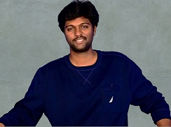

# Personal Info

**Narava Pranay Manikanta | _Email: npranayamanikanta@gmail.com_ | 4713 Belwood Green, Halethorpe, MD 21227** 

## Summary ##
- Confident and driven data science professional seeking an entry-level position in a professional company. Highly motivated and detail-oriented, passionate about leveraging data to drive insights and solve complex problems. Proficient in data modeling techniques and adept at harnessing technology to address real-world challenges. I am known for my ability to grasp new concepts and adapt to diverse work environments quickly. Eager to contribute my skills and continue learning in the dynamic field of data science. With a solid commitment to excellence, I am poised to make a positive impact and grow alongside a forward-thinking organization.

## Educational Background ##
- **University of Maryland Baltimore County Baltimore (U M B C)**,
  - _Master of Professional Studies_ 
  - _Data Science_
  - _CGPA:3.7_
  - _Expected in December 2023_
    
- **Koneru Lakshmaiah Education Foundation Andhra Pradesh, India**
  - _Bachelor of Technology_
  - _Electronics and Communication Engineering(E C E)_
  - _Graduated in May 2020_

## Experience ##
**SONAVI LABS**
_Data Science Intern   
Jul 2023 to currently   
Baltimore, MD_

- 
**BWTech@UMBC**     
_MD New Venture Fellowship Program    
Jan 2023 to May 2023    
Catonsville, MD_

- During my professional experience, I made significant contributions to the project Pneuma, which aimed to combat stress and address substance abuse through neuro-technology.
- Led customer discovery efforts, conducting surveys and interviews with 100+ individuals to understand their needs and preferences. And developed a comprehensive business plan, outlining market analysis, competitive 
landscape, and revenue projections, resulting in a 30% increase in projected profitability.
- Created financial models, including cash flow projections leading to a 25% reduction in projected costs.
- Presented project pitches to investors, achieving a 70% success rate in securing funding and garnering a $5000 grant as recognition for project excellence.
  
**Subrains Solutions Private Limited**     
 _Python Developer Intern   
 May 2019 to Jun 2019   
 Andhra Pradesh, India_
    
- I made notable contributions to the development of the Learning Module System (L.M.S), a platform facilitating student and teacher interaction.
- Developed clean and well-tested code for the L.M.S project, ensuring optimal performance and functionality.
- Gained valuable insights into best practices in software coding through mentorship, and implementing industry-standard techniques that improved the overall quality and efficiency of the project.
- Conducted code reviews and collaborated with the development team to identify and resolve critical issues, resulting in a 40% decrease in bug occurrences.

## LEADERSHIP EXPERIENCE ##
**UMBC Event Centre**    
_Event Staff    
March 2022 to Jan 2023   
Catonsville, MD_

- I am a member of the event staff at the UMBC Event Center. During this time, I gained a few crucial abilities, like time management, People Skills, communication, empathy, and emotional intelligence.

**Koneru Lakshmaiah Education Foundation Andhra Pradesh, India**   
_Student Event Coordinator   
Jan 2019 to Mar 2019_

- Planned large & small-scale events such as talks, conferences, and workshops.
- Monitor event activities to ensure compliance with applicable regulations and laws, the satisfaction of participants, and the resolution of any problems that arise.

## SKILLS & INTERESTS ##
- **Technical Skills:** Python, Data analysis, Excel, SQL, Statistics Tableau, Microsoft Power BI, Data Analysis, Data visualizations, Data Management, Data cleansing, ETL (Extract, Transform, Load), Data pipelines,
Predictive modeling, Data-driven decision making, Machine Learning, Big Data, Apache Spark, Hadoop, Dask, Snowflake, Data Bricks, Docker, Edge Computing like Jetson Nano, and Rapids (GPU Accelerated Computing).

- **Soft Skills:** People Skills, Problem-Solving Ability, Leadership, Time Management, Communication.

## ACHIEVEMENT ##
**Award Winner at MD New Venture Fellowship program 08 Nov’23,**
- I was honored to be awarded a $ 5,000 grant towards the development of PNEUMA, a revolutionary neuro-technology product aimed at combatting stress and addressing the root causes of substance use disorder (SUD). 
  - Article:- https://technical.ly/startups/2023-maryland-new-venture-fellowship-program/
  - LinkedIn:- https://www.linkedin.com/posts/pranayamanikanta07_awardwinning-bwtech-fellowshipprogram-activity-7061735646876332032-gGaY?utm_source=share&utm_medium=member_desktop
  
## PUBLICATIONS: ##
**Defect Detection using Active Contour Method 30 Nov'19,**   
_D4509118419 - International Journal of Recent Technology and Engineering (IJRTE)_
- Conducted research utilizing Active Contour segmentation and infrared thermography for nondestructive testing. 
- Developed an innovative method achieving 85% accuracy in classifying defects such as air, oil, water, and cracks in the subsurface area.
- Improved defect detection efficiency by 30% and reduced false positives by 25%, enhancing inspection capabilities.

## Bussiness Skills ##
- Management and Leadership.
- Project management.
- Time management.
- Problem-solving.
- Communication Skills.

## Technical/computer skills ##
- Programming languages --> **C**, **Java**, **Python**.
- Data Management.
- Software proficiency --> Excell, Matlab, GitHub, Tableau, Google Colab, Jupiter notebook,.....
- Operating Systems --> Windows, Mac OS, Linux.

## Awards ##
- Best Co-ordinator for National Level Technical Fest **"Samyak"**,2019 KL university(India).
- Badminton Championship, 2016 KL university(India). 

## Social activities ##
- Video games.
- Hiking.
- Volunteering.
- Traveling.
- Playing Badminton.

## Certificates ##
- [Machine Learning](https://coursera.org/share/6004b54663480e2953aa5841f9c26cf3).
- [Deep Learning](https://coursera.org/share/eef1316a10ebe3590db22e1b652c80df).
- [Learn Spanish: Basic Spanish Vocabulary Specialization](https://coursera.org/share/fbe78a7a29aebbe0805e60146f0a423c).
- [Data Science](https://trainings.internshala.com/s/v/237938/d55b7788)

## Publications ##
- [Defect Detection using Active Contour Method](https://www.ijrte.org/wp-content/uploads/papers/v8i4/D4509118419.pdf).
